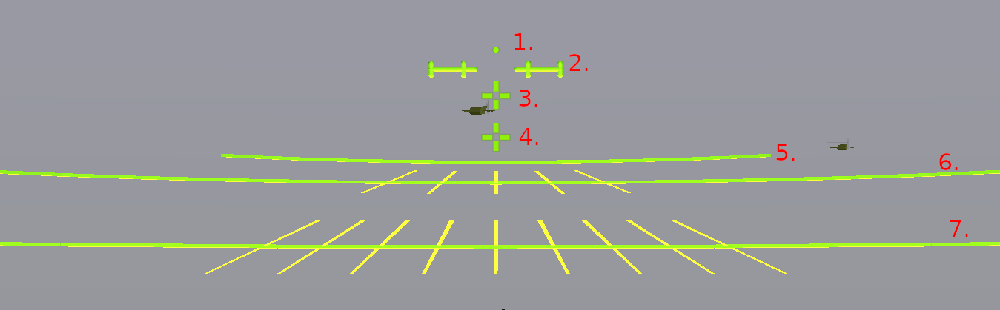

# 12,7mm ITKK 96 pöytäkonesimulaattori

Tämä on käyttöopas Eskolan Koodipajan tuottamaan vapaasti levitettävään ilmatorjuntakonekiväärisimulaattoriin.

Simuloitu ase on Suomen puolustusvoimien käyttämä ilmatorjuntakonekivääri, tyyppinimeltään 12,7 ITKK 96 NSV. Kyseinen ase on lähes joka yksikön käyttämä lähipuolustusase matalalla lentäviä viholliskoneita, erityisesti helikoptereita vastaan. Se soveltuu myös maamaaleja, varsinkin ajoneuvoja vastaan. Luodit läpäisevät noin 20mm panssaria, ja niissä on leimahduspanos joka on tarkoitettu sytyttämään osuman saaneen vihollisen ammukset tai polttoaineen. Itse ase on venäläisvalmisteinen, mutta siinä käytetty heijastintähtäin on länsivalmisteinen. Myös suomessa käytetty jalustaratkaisu on eri kuin alkuperäinen, ollen raskaampi ja useammasta osasta koostuva mutta vakaampi ja paremmin ilmatorjuntaan soveltuva.

Simulaattori itse on tarkoitettu tähtäimen käytön opettelemiseen. Puolustusvoimilla on käytössään oma simulaattori, AMSI 12,7, joka koostuu oikeaan ilmatorjuntakonekivääriin asennettavista suuntausanturista ja tähtäimen paikalla olevasta pienestä näyttöruudusta. Kyseinen simulaattori on sinänsä erinomainen, mutta vaatii ilmatorjuntakonekiväärin ja simulaattorilaitteiston (ja luvan niiden käyttöön!). Tämä simulaattori sen sijaan ei tarvitse muuta kuin tavallisen pöytätietokoneen tai läppärin, ja se on MIT-lisenssillä vapaasti kopioitavissa niin monelle laitteelle kuin tarvetta on.

## Simulaattorin käyttö

Suosittelen suurentamaan ikkunan koko ruudun tai lähes koko ruudun kokoiseksi mutta tämä ei ole välttämätöntä. Valitse tehtävä päävalikosta. Suosittelen tehtävää 1. ensimmäiseksi, koska sen maalit ovat helpompia.

Kun tehtävä on alkanut, paina enter kaapataksesi hiiren osoittimen (osoitin katoaa ja voit kääntää kameraa ilman että osoitin törmää ruudun laitaan). Saadaksesi osoittimen taas esille (lopettaaksesi tai siirtääksesi ruutua) paina esc.

Voit muuttaa kuvakulmaa (zoomata) hiiren rullasta, tai sen puutteessa plus- ja miinusnäppäimillä. Vasen hiiren painike laukaisee aseen. Vyössä on kuitenkin vain 50 patruunaa - paina r kun haluat vaihtaa sen. Alareunasta näet vyössä jäljellä olevien patruunoiden määrän, vyönvaihdon edistymisen ja etäisyyden muodostelman etummaiseen viholliseen.

Jos/kun osut viholliseen, huomaat sen luodin sytytyspanoksen aiheuttamasta leimahduksesta viholliskoneen kyljessä. Maalit eivät tällä hetkellä ole tuhoutuvia, mutta niissä on osumalaskuri. Lopettaaksesi tehtävän ja nähdäksesi osumien määrän, vapauta kursori ja paina "lopeta tehtävä" ruudun oikeassa yläkulmassa.

## Tähtäimen selitys

 1. Piippu osoittaa tähän
 2. 500 metrin tähtäin. Pystyviivat kertovat ennakon 20 tai 40 km/h sivuttain etenevään maaliin
 3. 1000m tähtäin
 4. 1500m tähtäin
 5. Ennakkokäyrä lähestyvälle ilmamaalille, jolla lentokorkeus 100m/s ja nopeus 187.5km/h, etäisyys luodin kohdatessa 1500m
 6. Ennakkokäyrä lähestyvälle ilmamaalille, jolla lentokorkeus 100m/s ja nopeus 375km/h, etäisyys luodin kohdatessa 1500m. Huomaa suunta-apuviivat - Lentokonee on lentämässä kohti ennakkopistettä mikäli suuntaviiva kulkee sen rungon mukaisesti.
 7. Ennakkokäyrä lähestyvälle ilmamaalille, jolla lentokorkeus 100m/s ja nopeus 1250km/h (noin 1 mach), etäisyys luodin kohdatessa 1500m. Huomaa suunta-apuviivat.
 
Ennakkokäyrän virallinen tulkinta poikkeaa näistä (viralliset arvot ovat 150m maalikorkeus ja suurimman käyrän maalinopeus 835km/h). Uskon kuitenkin, mittailtuani valokuvaa oikeasta tähtäimestä sen takaisinmallinnusta varten tähän simulaattoriin, että viralliset arvot ovat virheellisiä. Simulaattorin tähtäin toimii yllä luetellulla tulkinnalla ja niin luullakseni myös aito tähtäin.

## Tehokas ampumatekniikka

Ilmamaalit etenevät yleensä kymmenistä satoihin metrejä sekunnissa (simulaattorissa tällä hetkellä 60 tai 100 m/s), ja ampumaetäisyydet ovat jopa 2 kilometriä, enemmänkin varsinaisilla ilmatorjuntatykeillä. Mikään luoti tai kranaatti ei ole tarpeeksi nopea osuakseen tällaisiin maaleihin ilman huomattavaa etäisyyskorotusta ja vielä suurempaa ennakkoa. Et siis voi vain osoittaa maalia ja painaa liipaisinta. Oikean ennakon ja korotuksen arviointi on avain ilmatorjuntakonekiväärillä osumiseen.

Aseen tehokas ampumamatka ilmamaaleihin on 1,5 kilometriä. Kun aloitat tehtävän simulaattorissa, vihollismuodostelma on vielä reilusti kauempana kuin tämä. Vaikka voit aloittaa tulituksen heti kun haluat, parhaat mahdollisuudet osua ovat vasta vihollisten ollessa lähempänä. Itse asiassa jopa virallinen 1,5km on pitkänpuolinen etäisyys, usein tehokkain tulitusetäisyys on muutamia tai muutama sata metriä. Katso että vyössä on patruunoita kun vihollinen on tällä etäisyydellä! Aloita tulitus kuitenkin ennen kuin vihollinen on ohittamassa sinua. Vaikka vihollista voi tulittaa sivusta tai takaa, tämä on selvästi tehottomampaa mitä lähestyvän maalin ampuminen. Etäisyysmittari näytön alareunassa auttaa sinua valitsemaan hyvä tulenavaushetken ja arvioimaan tähtäyspisteen jolla aloitat.

Ammusilmatorjunnassa käytetään yleensä valojuovapatruunoita, eikä tämä simulaattori ole poikkeus - joka kolmas laukaus on valojuova. Hyödynnä tätä! Valojuovat kertovat mihin suuntaan ennakko ja/tai etäisyyskorotukses on pielessä. Oikeassa ilma-ammunnassa pyritään jopa käyttämään erillistä tähystäjää, joka keskittyy tarkkailemaan valojuovia ja kertomaan ampujalle mihin suuntaan tähtäystä pitää korjata. Mikään ei estä tekemästä tätä simulaattorissakaan.

Periaattessa paras tapa osua on että aseella pidetään koko ajan sillä hetkellä oikea ennakko ja etäisyyskorotus, jolloin tulituksen pitäisi olla koko ajan suunassa. Varsinkin nopeammille maaleille tämä voi kuitenkin olla epärealistisen vaikeaa, jolloin käytännössä on tehokkaampaa ampua sulkutulta. Tämä tarkoittaa sitä, että otetaan tarkoituksella ylipitkä ennakko, ja ammutaan kyseiseen pisteeseen pitkä sarja liikuttamatta asetta sarjan aikana. Tuloksena viholliskone lentää ammutun sarjan läpi, ja hyvällä todennäköisyydellä saa osuman tai pari.

## Kiitokset

 - Simulaattori käyttää [Godot 4](https://godotengine.org) - pelimoottoria
 - Tehty Godot-3 projektimallin [First-person Character](https://godotengine.org/asset-library/asset/305) pohjalta.
 - Ohjelmointi tehty lähes täysin [D-kielellä](https://dlang.org), käyttäen [Godot-Dlang-kirjastoa](https://code.dlang.org/packages/godot-dlang)
 - Ilmatorjuntamiehen käsikirja 2016
 - Wikimedia commonsin [kuvista aiheesta](https://commons.wikimedia.org/wiki/Category:NSV_in_Finnish_service) ovat peräisin sekä takaisinmallinnukseen käyttämäni heijastintähtäinkuvat että kuvake/päävalikkokuva aseesta.
 - Varusmiespalvelukseni jääkärijoukkueen ITKK-ampujana Kainuun prikaatissa 2012. Vaikka kaikki "raaka" tieto löytyy julkisista lähteistä ainakin merkittäviltä osiltaan, ei minulla olisi kokonaiskuvaa aseesta ilman koulutusta.
 - Maanpuolustuskoulutusyhdistyksen ilmatorjuntakurssi jonka olen käynyt 2-3 kertaa kerratakseni ja täydentääkseni tätä kokonaiskuvaa.
 - Puolustusvoimien simulaattori AMSI 12,7. En tietenkään ole voinut kopioida siitä mitään omaani, mutta muistikuvienkin varassa välittyy ideoita. 