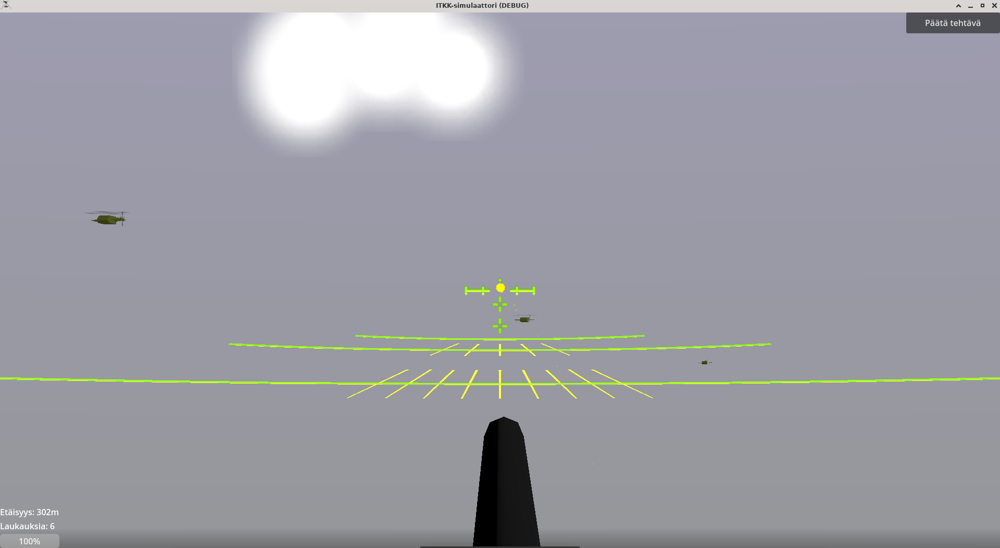

# 12,7mm ITKK 96 pöytäkonesimulaattori

Tämä on [Eskolan Koodipajan](https://koodipaja.ate-eskola.fi) tuottama vapaasti levitettävä ilmatorjuntakonekiväärisimulaattori. Soveltuu tähtäimen käytön ja ennakon arvoinnin harjoitteluun.



Lue [`liitteet/käyttöopas.md`](liitteet/käyttöopas.md) yleistietoa ja itse käyttöä varten

Koostamis - ja jakeluohjeet kirjoitettu Linuxin näkökulmasta. Windowsilla koostamisenkin pitäisi onnistua, mutta joudut selvittämään itse miten.

Aion laittaa valmiit binäärit ladattavaksi ihan pian, sitten ei tarvitse itse koostaa!

## Koostaminen

Tarvitset Godot 4 - pelimoottorin, D-kääntäjän ja D:n pakettienhallinnan, DUBin.

Käännä D-scriptit projektista: 
```
(cd dlang && dub build) && cp dlang/libfps-godot-modules.so ./libfps-godot-modules.s
```

Tai, jos julkaisuversiota haluat koostaa:
```
(cd dlang && dub build --build=release) && cp dlang/libfps-godot-modules.so ./libfps-godot-modules-release.so
```

Avaa projekti Godotilla ja työstä/aja kuten normaalisti.

## Jakeluversion tekeminen

Käytä Godotin projektinvientimekanismeja. Pakkaa mukaan käyttöopas ja `Tähtäin.png` `liitteet/`-kansiosta.

Jos olet viemässä Windowsille, D-skriptit pitää kääntää dll-tiedostoksi eikä `.so`:ksi. Vaikein osa tässä on saada D-kääntäjän ristiinkääntäminen toimimaan. Suosittelen LDC-kääntäjää, [Tämä artikkeli](https://wiki.dlang.org/Cross-compiling_with_LDC) toivottavasti auttaa.

Kun ristiinkääntö toimii,
```
(cd dlang && dub build --build=release --compiler=ldc2 --arch=x86_64-unknown-windows-msvc) && cp dlang/fps-godot-modules.dll ./fps-godot-modules-release.dll
```
.

Lisäksi joudut lataamaan Winen (Windows-sovellusten ajoympäristön Linuxille) ja jonkun Windows-sovelluksen Internetistä `.wine`-tiedostoihisi jotta kuvakkeen asettaminen Windows-sovellukselle onnistuu. Tämän tekeminen on dokumentoitu hyvin Godotissa - seuraa sen ohjeita.

## Lisenssi

(En läytänyt virallista suomennosta tälle, valitan)

Katso käyttöoppaasta mitä lähteitä ohjelman pohjana on käytetty

Copyright (c) 2024 Eskolan koodipaja

Permission is hereby granted, free of charge, to any person obtaining a copy of this software and associated documentation files (the "Software"), to deal in the Software without restriction, including without limitation the rights to use, copy, modify, merge, publish, distribute, sublicense, and/or sell copies of the Software, and to permit persons to whom the Software is furnished to do so, subject to the following conditions:

The above copyright notice and this permission notice shall be included in all copies or substantial portions of the Software.

THE SOFTWARE IS PROVIDED "AS IS", WITHOUT WARRANTY OF ANY KIND, EXPRESS OR IMPLIED, INCLUDING BUT NOT LIMITED TO THE WARRANTIES OF MERCHANTABILITY, FITNESS FOR A PARTICULAR PURPOSE AND NONINFRINGEMENT. IN NO EVENT SHALL THE AUTHORS OR COPYRIGHT HOLDERS BE LIABLE FOR ANY CLAIM, DAMAGES OR OTHER LIABILITY, WHETHER IN AN ACTION OF CONTRACT, TORT OR OTHERWISE, ARISING FROM, OUT OF OR IN CONNECTION WITH THE SOFTWARE OR THE USE OR OTHER DEALINGS IN THE SOFTWARE.